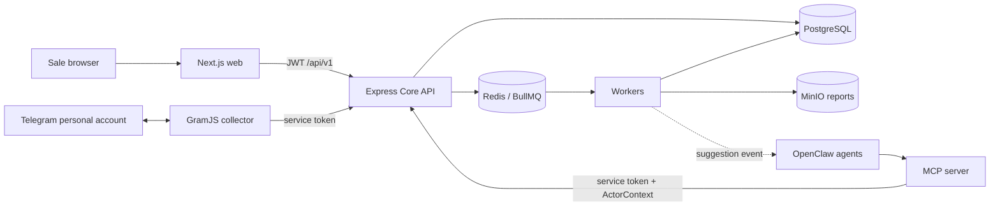
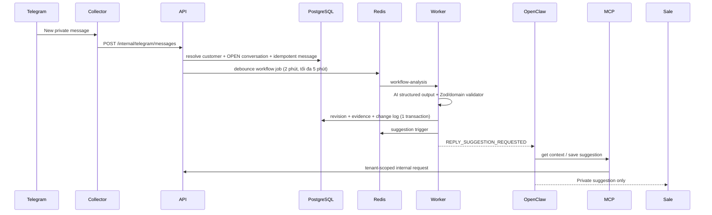

# Telegram Sales Intelligence

MVP quản lý và phân tích hội thoại tư vấn bán hàng qua tài khoản Telegram cá nhân. Sale vẫn trực tiếp chat với khách; AI chỉ dựng workflow có evidence, tạo gợi ý riêng cho sale và hỗ trợ phân tích. Hệ thống không có endpoint hoặc MCP tool gửi tin cho khách hàng.

## Kiến trúc



Core là modular monolith theo N-Layer, còn worker, collector và MCP là process biên có capability riêng. Các quyết định và trade-off nằm trong [docs/architecture](docs/architecture).

### N-Layer

- `packages/domain`: entity/type, enum, domain error, repository interface và policy; không import framework hay SDK.
- `packages/application`: use case và port cho AI, queue, storage, auth, collector; không gọi Prisma.
- `packages/infrastructure`: Prisma repository/transaction, Redis/BullMQ, MinIO, AI, JWT, AES-GCM và HTTP adapters.
- `apps/api`: presentation Express, Zod schema, auth/RBAC, Swagger, error mapping và health check.

## Cấu trúc

```text
apps/
  api/                 Express Core API
  web/                 Next.js App Router UI
  worker/              7 BullMQ queues
  telegram-collector/  GramJS + fake Telegram mode
  mcp-server/           MCP SDK stdio/HTTP server
packages/
  domain/ application/ infrastructure/ contracts/ shared/
prisma/
  schema.prisma migrations/ seed.ts
docker/
docs/architecture/
docker-compose.yml
```

## Chạy bằng Docker

Yêu cầu Docker Desktop/Engine có Compose v2 và tối thiểu khoảng 4 GB RAM trống.

```bash
cp .env.example .env
docker compose up --build
```

API container tự chạy `prisma migrate deploy` và seed idempotent. Sau khi healthy:

- Web: http://localhost:3000
- API: http://localhost:4010 (đặt `API_HOST_PORT=4000` nếu port 4000 đang rảnh)
- Swagger: http://localhost:4010/docs
- OpenAPI JSON: http://localhost:4010/openapi.json
- MinIO console: http://localhost:9011 (`minioadmin` / `minioadmin123` cho local demo). Đặt `MINIO_CONSOLE_PORT=9001` nếu port 9001 đang rảnh.
- MCP HTTP: http://localhost:4200/mcp

Chạy migration/seed thủ công:

```bash
docker compose exec api pnpm db:migrate
docker compose exec api pnpm db:seed
```

Credential demo:

```text
Admin: admin@demo.local / Demo123!
Sale:  sale@demo.local  / Demo123!
```

## Chạy local

Node.js 22+, Corepack và PostgreSQL/Redis/MinIO đang chạy:

```bash
corepack pnpm install
corepack pnpm db:generate
corepack pnpm db:migrate
corepack pnpm db:seed
corepack pnpm dev
```

Sao chép `.env.example` thành `.env` và đổi host service từ tên Docker (`postgres`, `redis`, `minio`) thành `localhost` khi chạy ngoài Compose. Secret trong file mẫu chỉ dành cho local; phải thay JWT, internal token, encryption key và MinIO credentials ở môi trường thật.

## Telegram cá nhân

Không cấu hình `TELEGRAM_API_ID`/`TELEGRAM_API_HASH` thì collector dùng fake mode. Trên UI, nhập số bất kỳ hợp lệ, dùng OTP `12345`, mở private chat mẫu và bấm “Thêm”. Collector sẽ sync ba message mẫu vào Core API.

Để dùng Telegram thật:

1. Lấy API ID/hash cho ứng dụng Telegram của bạn và điền vào `.env`.
2. Mở **Telegram Configuration**, nhập số điện thoại, OTP nhận trực tiếp từ Telegram và 2FA nếu được yêu cầu.
3. Chọn private chat cần quản lý; collector sync tối đa 100 message text gần nhất rồi lắng nghe new/edited/deleted events.

OTP và mật khẩu 2FA chỉ tồn tại trong request/in-memory callback, không ghi DB/log. `StringSession` được mã hóa AES-256-GCM bằng `ENCRYPTION_KEY`. Đổi key cần kế hoạch re-encryption; mất key đồng nghĩa session đã lưu không thể giải mã.

## OpenClaw và hai bot

OpenClaw quản lý bot token và private chat với sale. Repo không đoán cú pháp cấu hình của một phiên bản OpenClaw cụ thể. Dùng [docker/openclaw-agents.example.json](docker/openclaw-agents.example.json) như bản đồ placeholder, rồi chuyển các trường sang cú pháp trong tài liệu phiên bản đang cài.

Luồng cấu hình khái niệm:

1. Tạo Suggestion Bot và Analyst Bot trong OpenClaw, mỗi bot chỉ pair private với Telegram user của sale.
2. Đăng ký MCP HTTP `http://mcp-server:4200/mcp` hoặc stdio `pnpm --filter @tsi/mcp-server start` với `MCP_TRANSPORT=stdio`.
3. Gửi các header actor `x-organization-id`, `x-employee-id`, `x-employee-role`, `x-agent-type` khi dùng HTTP.
4. Worker có thể POST event `REPLY_SUGGESTION_REQUESTED` tới `OPENCLAW_WEBHOOK_URL`; payload chỉ có tenant/employee/conversation/message ID, không có secret.

### Tool policy

Suggestion Agent chỉ được phép:

```text
get_reply_suggestion_context, get_customer_history, get_workflow_graph,
get_workflow_node_evidence, compare_conversations, save_reply_suggestion,
record_suggestion_feedback, request_alternative_suggestion, create_calendar_draft
```

Analyst Agent được phép:

```text
find_customers, find_conversations, get_customer_profile, get_customer_history,
get_conversation_context, get_conversation_timeline, get_recent_messages,
get_workflow_graph, get_workflow_node_evidence, get_reply_suggestion,
get_suggestion_basis, get_insights, get_employee_metrics, compare_conversations,
record_suggestion_feedback, list_reports, get_report_download_url,
create_calendar_draft
```

Các capability bị cấm: gửi/sửa/xóa tin nhắn khách hàng, gửi Telegram dưới danh nghĩa sale, đọc Telegram session, chạy SQL, tự đóng conversation hoặc tự đánh dấu WON. Chúng không được đăng ký trong MCP và cũng không tồn tại trong Core API.

## Message, workflow và suggestion



Nếu conversation gần nhất đã CLOSED, message mới tạo conversation OPEN mới có `previous_conversation_id`; summary trước được đưa vào context. Outcome chỉ đổi qua `POST /api/v1/conversations/:id/close` bởi sale phụ trách, manager, admin hoặc owner.

## Daily report và MinIO

Worker chạy theo timezone organization, tính metric bằng query/code, render JSON/HTML, upload bucket `reports`, rồi lưu metadata/object key vào PostgreSQL. UI gọi API để nhận presigned URL 15 phút. Compose tạo bucket và upload report seed tại:

```text
organizations/{organizationId}/reports/{yyyy}/{mm}/{dd}/{reportId}.html
```

## Kiểm thử và chất lượng

```bash
corepack pnpm test
corepack pnpm lint
corepack pnpm typecheck
corepack pnpm build
```

12 unit test bao phủ conversation resolution, idempotency, workflow evidence/locked node, AI outcome safety, suggestion trigger, MinIO port, tenant isolation và employee metric. Swagger ở `/docs`; Pino redaction che authorization, OTP, password, session, token, key và secret.

## Giả định và giới hạn MVP

- Quy mô demo nhỏ, một PostgreSQL và một Redis; chưa có HA, SSO, refresh token hay key rotation service.
- UI dùng JWT trong local storage để đơn giản hóa demo; production nên dùng BFF/httpOnly cookie và CSRF protection.
- Collector giữ login challenge/client trong memory; restart trong lúc OTP sẽ phải bắt đầu lại.
- Deleted message sync phụ thuộc mapping đã quan sát trong process collector; Telegram event có thể thiếu peer context.
- Fake AI tạo workflow dự đoán được; OpenAI-compatible mode dùng JSON response nhưng chưa có provider-specific JSON Schema negotiation.
- Duplicate node MVP dùng normalized title; chưa dùng embedding/semantic clustering.
- Insight chỉ nên được diễn giải khi sample size đủ lớn; seed cố ý có confidence thấp để minh họa dữ liệu nhỏ.
- OpenClaw webhook/config cần map theo phiên bản đang sử dụng. Repo chỉ cung cấp contract và placeholder.
