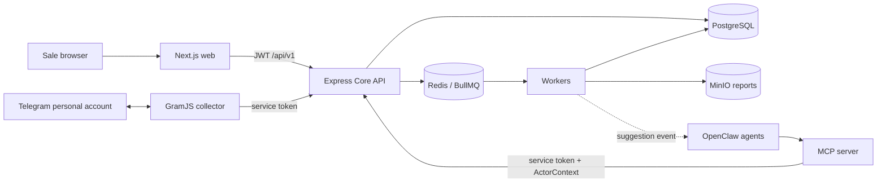

# Telegram Sales Intelligence

MVP for managing and analyzing sales-consultation conversations through personal Telegram accounts. Sales reps still chat directly with customers; AI only builds evidence-backed workflows, creates private suggestions for the rep, and supports analysis. The system has no endpoint or MCP tool that can send messages to customers.

## Architecture



The core is a modular monolith following N-Layer architecture. Workers, the collector, and MCP are edge processes with their own capabilities. Decisions and trade-offs are documented in [docs/architecture](docs/architecture).

### N-Layer

- `packages/domain`: entities/types, enums, domain errors, repository interfaces, and policies; no framework or SDK imports.
- `packages/application`: use cases and ports for AI, queues, storage, auth, and collectors; no Prisma calls.
- `packages/infrastructure`: Prisma repositories/transactions, Redis/BullMQ, MinIO, AI, JWT, AES-GCM, and HTTP adapters.
- `apps/api`: Express presentation layer, Zod schemas, auth/RBAC, Swagger, error mapping, and health checks.

## Structure

```text
apps/
  api/                 Express Core API
  web/                 Next.js App Router UI
  worker/              7 BullMQ queues
  telegram-collector/  GramJS + fake Telegram mode
  mcp-server/          MCP SDK stdio/HTTP server
packages/
  domain/ application/ infrastructure/ contracts/ shared/
prisma/
  schema.prisma migrations/ seed.ts
docker/
docs/architecture/
docker-compose.yml
```

## Run With Docker

Requires Docker Desktop/Engine with Compose v2 and roughly 4 GB of free RAM.

```bash
cp .env.example .env
docker compose up --build
```

The API container automatically runs `prisma migrate deploy` and idempotent seed data. After the stack is healthy:

- Web: http://localhost:3000
- API: http://localhost:4010 (set `API_HOST_PORT=4000` if port 4000 is available)
- Swagger: http://localhost:4010/docs
- OpenAPI JSON: http://localhost:4010/openapi.json
- MinIO console: http://localhost:9011 (`minioadmin` / `minioadmin123` for local demo). Set `MINIO_CONSOLE_PORT=9001` if port 9001 is available.
- MCP HTTP: http://localhost:4200/mcp

Run migrations or seed manually:

```bash
docker compose exec api pnpm db:migrate
docker compose exec api pnpm db:seed
```

Demo credentials:

```text
Admin: admin@demo.local / Demo123!
Sale:  sale@demo.local  / Demo123!
```

## Run Locally

Node.js 22+, Corepack, PostgreSQL, Redis, and MinIO must be running:

```bash
corepack pnpm install
corepack pnpm db:generate
corepack pnpm db:migrate
corepack pnpm db:seed
corepack pnpm dev
```

Copy `.env.example` to `.env` and change Docker service hosts (`postgres`, `redis`, `minio`) to `localhost` when running outside Compose. Secrets in the sample file are only for local development; replace JWT, internal token, encryption key, and MinIO credentials in real environments.

## Personal Telegram

Without `TELEGRAM_API_ID` and `TELEGRAM_API_HASH`, the collector uses fake mode. In the UI, enter any valid phone number, use OTP `12345`, open a sample private chat, and select **Add**. The collector syncs three sample messages into the Core API.

To use real Telegram:

1. Get an API ID/hash for your Telegram application and put them in `.env`.
2. Open **Telegram Configuration**, enter the phone number, the OTP received from Telegram, and 2FA if required.
3. Select the private chat to manage; the collector syncs up to the latest 100 text messages and then listens for new, edited, and deleted events.

OTP and 2FA passwords only exist in the request/in-memory callback and are never written to the database or logs. `StringSession` is encrypted with AES-256-GCM using `ENCRYPTION_KEY`. Changing the key requires a re-encryption plan; losing the key means stored sessions cannot be decrypted.

## OpenClaw And Two Bots

OpenClaw manages bot tokens and private chats with sales reps. This repo does not assume the exact config syntax for a specific OpenClaw version. Use [docker/openclaw-agents.example.json](docker/openclaw-agents.example.json) as a placeholder map, then translate the fields into the syntax for the installed version.

Conceptual setup flow:

1. Create a Suggestion Bot and an Analyst Bot in OpenClaw; each bot should be paired privately only with the sales rep's Telegram user.
2. Register MCP over HTTP at `http://mcp-server:4200/mcp` or stdio with `pnpm --filter @tsi/mcp-server start` and `MCP_TRANSPORT=stdio`.
3. Send actor headers `x-organization-id`, `x-employee-id`, `x-employee-role`, and `x-agent-type` when using HTTP.
4. The worker can POST `REPLY_SUGGESTION_REQUESTED` events to `OPENCLAW_WEBHOOK_URL`; payloads only contain tenant/employee/conversation/message IDs and no secrets.

### Tool Policy

Suggestion Agent is only allowed to use:

```text
get_reply_suggestion_context, get_customer_history, get_workflow_graph,
get_workflow_node_evidence, compare_conversations, save_reply_suggestion,
record_suggestion_feedback, request_alternative_suggestion, create_calendar_draft
```

Analyst Agent is allowed to use:

```text
find_customers, find_conversations, get_customer_profile, get_customer_history,
get_conversation_context, get_conversation_timeline, get_recent_messages,
get_workflow_graph, get_workflow_node_evidence, get_reply_suggestion,
get_suggestion_basis, get_insights, get_employee_metrics, compare_conversations,
record_suggestion_feedback, list_reports, get_report_download_url,
create_calendar_draft
```

Forbidden capabilities: sending/editing/deleting customer messages, sending Telegram messages as the sales rep, reading Telegram sessions, running SQL, closing conversations automatically, or marking conversations as WON automatically. These capabilities are not registered in MCP and do not exist in the Core API.

## Messages, Workflow, And Suggestions


If the latest conversation is already CLOSED, a new customer message creates a new OPEN conversation with `previous_conversation_id`; the previous summary is loaded into context. Outcome changes only through `POST /api/v1/conversations/:id/close` by the assigned sales rep, manager, admin, or owner.

## Daily Report And MinIO

The worker runs in the organization timezone, calculates metrics with queries/code, renders JSON/HTML, uploads to the `reports` bucket, then stores metadata/object keys in PostgreSQL. The UI calls the API to receive a 15-minute presigned URL. Compose creates the bucket and uploads the seed report at:

```text
organizations/{organizationId}/reports/{yyyy}/{mm}/{dd}/{reportId}.html
```

## Testing And Quality

```bash
corepack pnpm test
corepack pnpm lint
corepack pnpm typecheck
corepack pnpm build
```

The 12 unit tests cover conversation resolution, idempotency, workflow evidence/locked nodes, AI outcome safety, suggestion trigger, MinIO port, tenant isolation, and employee metrics. Swagger is available at `/docs`; Pino redaction hides authorization, OTP, password, session, token, key, and secret fields.

## MVP Assumptions And Limits

- The demo scale is small: one PostgreSQL and one Redis; no HA, SSO, refresh-token flow, or key-rotation service yet.
- The UI stores JWT in local storage to keep the demo simple; production should use a BFF/httpOnly cookie and CSRF protection.
- The collector keeps login challenges/clients in memory; restarting during OTP requires starting over.
- Deleted-message sync depends on mappings observed in the collector process; Telegram events may lack peer context.
- Fake AI generates deterministic workflows; OpenAI-compatible mode uses JSON responses but does not yet negotiate provider-specific JSON Schema support.
- Duplicate-node detection uses normalized titles in the MVP; embeddings/semantic clustering are not used yet.
- Insights should only be interpreted when sample size is large enough; seed data intentionally includes low-confidence examples to illustrate small datasets.
- OpenClaw webhook/config mapping must follow the installed version. This repo provides the contract and placeholders only.
